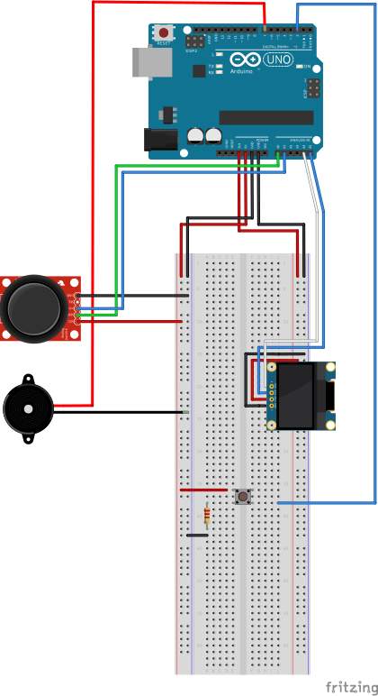

# Arduino-Lockpicking-Game

## Table of Contents
- [Description](#description)
- [Hardware Setup](#hardware-setup)
- [Software Architecture](#software-architecture)
- [Installation](#installation)
- [Usage](#usage)

## Description

A simple lockpicking game developed for Arduino, inspired by lockpicking minigames in games like Skyrim or Oblivion, in which the player must rely on visual and auditory feedback to position the cursor correctly to pick a lock.

## Hardware Setup

### Components
- **Arduino Uno**
- **OLED Screen**
- **Joystick Module**
- **Push Button**
- **Buzzer**

### Connections

## Software Architecture

## Installation

After completing the hardware setup simply flash the program to the arduino and you will be ready to go.

## Usage

Once installed the game will begin right away, the player must find a randomly generated position on the lock, indicated by the frequency of the buzzers sound, and then press the push button to attempt to pick it. If they are close enough to the desired position they will pass, however if they are not positioned correctly they will break one of three lockpicks, if all break they lose. If however they can suscesfully pick the lock three times the will win and be shown the time it took for them to complete the game, before the whole thing resets and they can choose to go agin if they wish.

